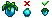
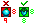
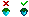
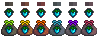
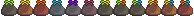
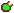
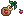

# STANDARDIZED SEED SPRITES - SPRITE CREATION DOCUMENTATION

## Part A: Making Crop Icons
    - Always check the original sprite icons from the mod you are adding.
    - Original crop icons from some mods may not meet the below criteria.

### REQUIREMENTS (5)
These are a list of guidelines that help ensure that all the crop icons look neat, standardized and beautiful.

### #1 
- **MUST** look like the full size crop
    - The crop icons should ultimately look as similar to their full sprite crops as possible, check each full sprite crop to make sure it looks right.
    - Sometimes this means you will need to create a brand new crop icon instead of pulling it from the original seed sprites from the mod in question.

---

### #2 
- **MUST** be 8x8 pixels or less
    - The crop icon itself should always be less than 8 pixels by 8 pixels, this will ensure that it fits properly on each seed packet variant.
    - It is important to convey a relative sense of size with certain crops, check the original crop sprites to see how things should be sized.

---

### #3 
- **MUST** have a colored border around the crop icon
    - The main portion of the crop, whether that be a fruit, vegetable etc, needs to be outlined with a darker color so that the whole icon stands out.
    - Some stems, leaves and other extra flair can remain un-outlined, however the sprite should remain within the 8x8 constriction previously mentioned.

---

### #4
- **MUST** not have shading on the colored border
    - The colored border around each crop icon that was previously mentioned above should not have any shading to indicate shadows or depth.
    - The crop icons are intended to visually stand out against the packet variants, and therefore should all be a uniform color all around.

---

### #5
- **MUST** have a black outline around the crop icon
    - This is different from the colored border mentioned above, this one pixel outline should be black #000000 with an opacity of 15%, or linear burn at 10%.
    - This black outline will almost always extend past the 8x8 constriction previously mentioned and will be barely visible until you add a seed packet variant.

---

## Part B: Making Seed Sleeves
    - See seasonal packet references on the Nexus Page for examples.
    - Each variant requires you overlay your crop icon from Part A.

### GENERAL REQUIREMENTS (2)
These requirements apply to all seed sleeves.

### #1
- **MUST** follow the correct placement
    - Each crop icon should be placed roughly centered on the sleeve, but smaller icons should be lowered not raised.
    - The crop icon should not extend past the green area shown in the reference, this include the missing pixel.

---

### #2 
- **MUST NOT** let crop border extend past the dead zone
    - Each crop icon, including its black outline should not extend past the red area of the reference below.
    - This area is known as the dead zone and should only have the sleeve without any of the crop icon present.

---

### SENSIBLE SLEEVE REQUIREMENTS (1)
Requirements for creating sensible seed sleeves.

- **MUST** use an appropriate sleeve color
    - The sleeve color should complement the crop icon and make it stand out, usually this will be a similar color to the crop itself but make sure it doesn't make the crop icon blend in too much.
    - The sleeve coloration should have highlights and dark colors correctly used in accordance with the black/white reference, there are a total of five colors in each sleeve.
    - Choose a color complementary to the crop icon you created to recolor a sleeve using: `template-sensible-sleeves.png` and the reference below.

---

### SEASONAL SLEEVE REQUIREMENTS (1)
Requirements for creating seasonal seed sleeves.

- **MUST** use the appropriate seasonal sleeve
    - Each season has its own sleeve color that is used to indicate which seasons the crop grows in.
    - Crops that grow in two seasons get a dual colored sleeve, while any that grow in more than three seasons get the tri-all season sleeve.
    - Choose the correct seasonal sleeve color for the crop's growth period, using the sprites found at: `template-seasonal-sleeves.png` and the reference below.

---

## Part C: Making Seed Stashes
    - See seasonal stash references on the Nexus Page for examples.
    - Each variant requires you overlay your crop icon from Part A.

### GENERAL REQUIREMENTS (2)
These requirements apply to all seed stashes.

### #1
- **MUST** follow the correct placement
    - Each crop icon should be placed roughly centered on the stash, but smaller icons should be lowered not raised.
    - The crop icon should not extend past the green area shown in the reference, this includes the missing pixel.

---

### #2 
- **MUST NOT** let crop border extend past the dead zone
    - Each crop icon, including its black outline should not extend past the red area of the reference below.
    - This area is known as the dead zone and should only have the stash without any of the crop icon present.

---

### SEASONAL STASH REQUIREMENTS (1)
Requirements for creating seasonal seed stashes.

- **MUST** use the appropriate seasonal stash
    - Each season has its own stash design that is used to indicate which seasons the crop grows in.
    - Crops that grow in two seasons get a dual colored stash, while any that grow in more than three seasons get the tri-all season stash.
    - Choose the correct seasonal stash design for the crop's growth period, using the sprites found at: `template-seasonal-stashes.png` and the reference below

---

## Part D: Making Seed Satchels
    - See seasonal satchel references on the Nexus Page for examples.
    - Each variant requires you overlay your crop icon from Part A.

### GENERAL REQUIREMENTS (3)
These requirements apply to all seed satchels.

### #1
- **MUST** follow the correct placement
    - Each crop icon should be placed roughly centered on the satchel, but smaller icons should be lowered not raised.
    - The crop icon should not extend past the green area shown in the reference, this includes the missing pixel.

---

### #2
- **MUST NOT** let crop border extend past the dead zone
    - Each crop icon, including its recolored outline should not extend past the red area of the reference below.
    - This area is known as the dead zone and should only have the satchel without any of the crop icon present.

---

### #3 
- **MUST** recolor the black outline to match the satchel
    - The opaque black outline created around each crop icon in part A should be recolored to match the satchel.
    - Each outline should use two colors from the chart below and should mimic a shadow around the sprite.

---

### SEASONAL SATCHEL REQUIREMENTS (1)
Requirements for creating seasonal seed satchels.

- **MUST** use the appropriate seasonal satchel
    - Each season has its own satchel design that is used to indicate which seasons the crop grows in.
    - Crops that grow in two seasons get a dual colored satchel, while any that grow in more than three seasons get the tri-all season satchel.
    - Choose the correct seasonal satchel design for the crop's growth period, using the sprites found at: `template-seasonal-satchels.png` and the reference below.

---

## Part E: Adding the Extras
    - This final step applies to crops with special growing conditions.
    - Only required for crops that grow on either a trellis or as a bush.
    - Bush crops are added by mods that use the Custom Bush Mod as a dependency.

This step is rather straightforward. Once you have completed a full sheet of sprites for a mod, simply follow the reference below to add trellis and bush indicators to crops that grow in those specific ways. The indicators visually communicate to players how these crops will behave in-game.

Check the reference image thoroughly for exact placement locations. Precise positioning of these indicators is essential for maintaining visual consistency across all the supported mods. Improperly placed indicators can create visual inconsistencies when viewed in the game environment.

### Trellis Crops

### Bush Crops

---

## Part F: Making the Saplings
    - Follow these guidelines to create standardized sapling sprites.
    - Use the provided templates for consistent results across all mods.

### REQUIREMENTS (5)
These requirements ensure that all sapling sprites maintain visual consistency.

### #1
- **MUST** follow the correct placement
    - Each crop icon should be placed in the designated position on the sapling template.
    - Ensure consistent positioning across all sapling variants for the same crop.

---

### #2 
- **MUST NOT** let crop border extend past the dead zone
    - Each crop icon should stay within the boundaries shown in the reference.
    - This ensures that the crop icon doesn't visually interfere with the sack.

---

### #3
- **MUST** use the original crop icon
    - Use the crop icon directly from the source of the original mod sprites.
    - Adjust a bit if needed but for the most part the original should be perfectly fine.

---

### #4
- **MUST** use an appropriate sapling stalk
    - This is mostly by look, find a sapling stalk from the template that looks good to you!
    - Use the provided template to find the most fitting stalk: `template-sapling-stalks.png`.

---

### #5
- **MUST** create five sack colors
    - Simply place the crop icon in the same place on each of the five different sack colors.
    - This can be done on a spritesheet using the appropriately named templates:
        - `template-chest-saplings.png`
        - `template-cream-saplings.png`
        - `template-cloud-saplings.png`
        - `template-cinder-saplings.png`

---